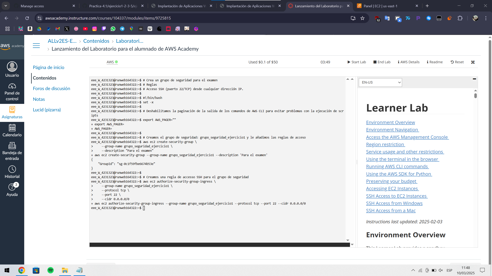
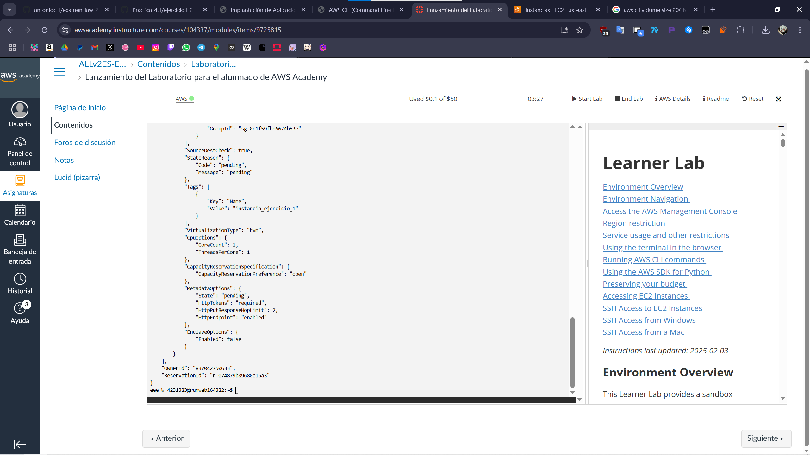

# examen-iaw-2-eval
Examen del dia 10/03/2025

# Ejercicio 1:

## Grupo de Seguridad
```bash
#!/bin/bash 
set -x 

# Deshabilitamos la paginación de la salida de los comandos de AWS CLI para evitar problemas con la ejecución de scripts
export AWS_PAGER=""

# Creamos el grupo de seguridad: backend-sg y le añadimos las reglas de acceso
aws ec2 create-security-group \
    --group-name grupo_seguridad_ejercicio_1 \
    --description "Para el examen"

# Creamos una regla de accesso SSH para el grupo de seguridad
aws ec2 authorize-security-group-ingress \
    --group-name grupo_seguridad_ejercicio_1 \
    --protocol tcp \
    --port 22 \
    --cidr 0.0.0.0/0
```


## Instancia EC2
```bash
#!/bin/bash 
set -x

# Deshabilitamos la paginación de la salida de los comandos de AWS CLI para evitar problemas con la ejecución de scripts
export AWS_PAGER=""

# Creamos una intancia EC2 para el backend con las características indicadas
aws ec2 run-instances \
    --image-id ami-04b4f1a9cf54c11d0 \
    --count 1 \
    --instance-type t2.small \
    --key-name vockey \
    --security-groups grupo_seguridad_ejercicio1 \
    --tag-specifications "ResourceType=instance,Tags=[{Key=Name,Value=instancia_ejercicio_1}]" \
    --block-device-mappings "[{\"DeviceName\":\"/dev/sda1\",\"Ebs\":{\"VolumeSize\":20,\"DeleteOnTermination\":false}}]"
```


# Ejercicio 2

