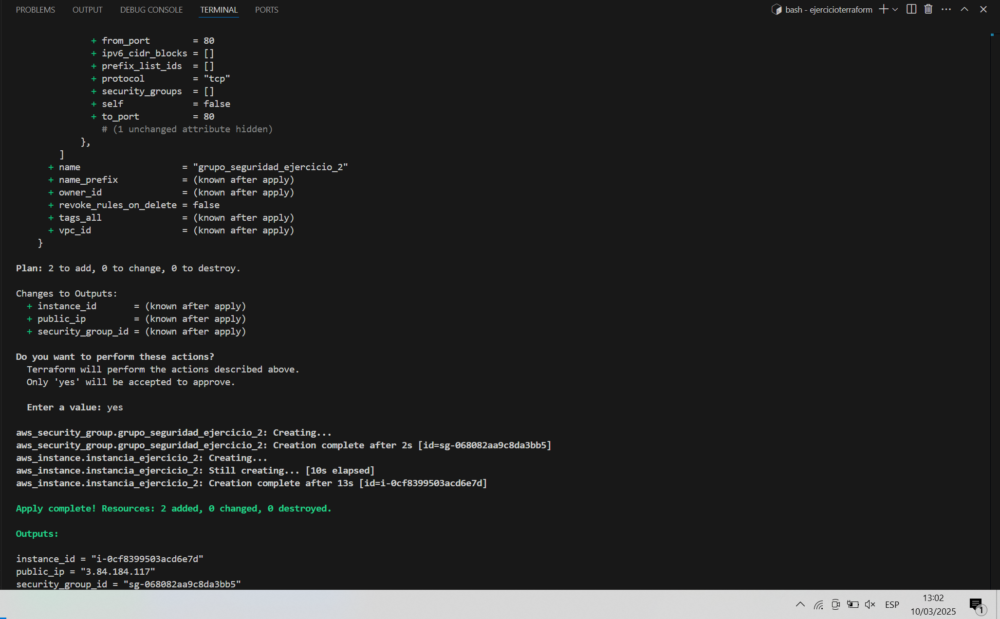

# examen-iaw-2-eval
Examen del dia 10/03/2025

# Ejercicio 1:

## Grupo de Seguridad
```bash
#!/bin/bash 
set -x 

# Deshabilitamos la paginación de la salida de los comandos de AWS CLI para evitar problemas con la ejecución de scripts
export AWS_PAGER=""

# Creamos el grupo de seguridad: backend-sg y le añadimos las reglas de acceso
aws ec2 create-security-group \
    --group-name grupo_seguridad_ejercicio_1 \
    --description "Para el examen"

# Creamos una regla de accesso SSH para el grupo de seguridad
aws ec2 authorize-security-group-ingress \
    --group-name grupo_seguridad_ejercicio_1 \
    --protocol tcp \
    --port 22 \
    --cidr 0.0.0.0/0
```


## Instancia EC2
```bash
#!/bin/bash 
set -x

# Deshabilitamos la paginación de la salida de los comandos de AWS CLI para evitar problemas con la ejecución de scripts
export AWS_PAGER=""

# Creamos una intancia EC2 para el backend con las características indicadas
aws ec2 run-instances \
    --image-id ami-04b4f1a9cf54c11d0 \
    --count 1 \
    --instance-type t2.small \
    --key-name vockey \
    --security-groups grupo_seguridad_ejercicio1 \
    --tag-specifications "ResourceType=instance,Tags=[{Key=Name,Value=instancia_ejercicio_1}]" \
    --block-device-mappings "[{\"DeviceName\":\"/dev/sda1\",\"Ebs\":{\"VolumeSize\":20,\"DeleteOnTermination\":false}}]"
```


# Ejercicio 2

## Terraform init


## Terraform validate


## Terraform plan


## Terraform apply


## Terraform show


# Ejercicio 3

## Comando de para ejecutar el playbook
```bash
ansible-playbook -i inventory/inventario main.yaml
```


# Ejercicio 4

## Ejecución de DockerFile


## Docker images para ver que se han creado correctamente los contenedores
Tengo 2, porque e primero que hice no llevaba el nombre del repo.


# Ejercicio 5
Primero hago login en docker con 
```bash
docker login -u antoniocl1
```
Ahora debemos introducir el token generado en Docker Hub, yo me he generado un token para este examen

Copiamos y pegams la password ya estaremos con la sesión iniciada:


Ahora haremos
```bash
sudo docker run -d -p 80:80 antoniocl1/examen-iaw-2-eval
```
Y después 
```bash
sudo docker push antoniocl1/examen-iaw-2-eval:latest
```

 Para configurar github actionsDebemos tener sincronizado Github con Docker Hub para empezar, después debemos de crear 2 "Secrets" en nuestro repo para las Github Actions, (creo que con el nombre de cada secreto se entiende para lo que sirve cada uno de ellos), deben de quedar así:

DOCKERHUB_USERNAME= antoniocl1
DOCKERHUB_TOKEN= Mi token creado en el paso 3 Esto lo hacemos dentro de nuestro repo, en el apartado de "Settings", vamos a "Secrets and variables" y específicamente a "Actions".

